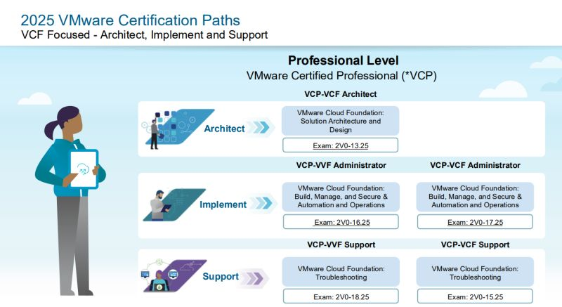

# VMware Certified Professional - VMware Cloud Foundation Administrator (2V0-17.25)

Exam Details  
Language: English  
Duration: 135 Minutes  
Number of Questions: 60 (English)  
Format: Multiple Choice, Multiple Choice Multiple Selection  
Passing Score: 300  
Pricing: $250  

Exam page:
https://www.broadcom.com/support/education/vmware/certification/vcp-vcf-administrator

## What to learn
https://docs.broadcom.com/doc/vmware-cloud-foundation-administrator-exam-guide

VCF 9 documenatation
- https://techdocs.broadcom.com/us/en/vmware-cis/vcf/vcf-9-0-and-later/9-0.html

What is a private cloud
https://www.vmware.com/topics/private-cloud

Hands-On lab
- https://labs.hol.vmware.com/HOL/catalog

Broadcom URL:
https://www.broadcom.com/support/education/vmware/certification/vcp-vcf-administrator

VCF Automation 9 Video Series
- https://www.youtube.com/playlist?list=PL8_k3uUCO39ukTT0IPWtoI8ksL-19Bkfp

Exam review
- https://www.ntpro.nl/blog/archives/3835-VMware-Cloud-Foundation-Administrator-2V0-17.25-in-the-pocket!.html

Explore Las Vegas sessions
- https://github.com/lamw/vmware-explore-2025-session-urls

Test exams:
https://www.examtopics.com/discussions/vmware/view/315128-exam-2v0-1725-topic-1-question-20-discussion/
https://www.certqueen.com/2V0-17.25-exam.html

Holodeck 9
https://blogs.vmware.com/cloud-foundation/2025/11/09/add-clusters-and-hosts-in-vcf-using-holodeck/

VCF blogs
https://blogs.vmware.com/cloud-foundation/

VCF 9 Technical Overview | Part 1 | Modernize Infrastructure
https://www.youtube.com/watch?v=92V-a34pLNU&list=PL8_k3uUCO39ueFJmiyuNID9UoYIshSsFr&index=3

VCP-VCF Administrator Exam Study Group Series 
https://www.youtube.com/playlist?list=PLnopqt07fPn3X3ChBZ0DAk50A8DP1P6z1

Home Lab
https://www.youtube.com/@aliwareit

Broadcom Certification Manager website
https://www.certmetrics.com/vmware/default.aspx

VMware Cloud Foundation (VCF 9) frequently Asked Questions.
https://www.vmware.com/docs/vmware-cloud-foundation-9-0-general-faqs

Study Resources & Exam Readiness
https://www.youtube.com/watch?v=Y9HX2f7CvCw

# VMware Cloud Foundation Administrator Exam Guide (2V0-17.25)

## Exam Details
**Last Updated:** 8/15/2025

The VMware Cloud Foundation Administrator (2V0-17.25) exam leads to VMware Certified Professional – VMware Cloud Foundation Administrator certification (VCP-VCF Administrator).

- **Number of Items:** 60
- **Passing Score:** 300 (scaled method)
- **Appointment Time:** 135 minutes

### Exam Delivery
This is a proctored exam delivered through Pearson VUE.

## Minimally Qualified Candidate

The candidate has the knowledge to install, configure, manage, and perform basic troubleshooting of a VMware Cloud Foundation (VCF) solution. The candidate is knowledgeable in the features, functions, and architecture of VCF and its components, including:
- vCenter
- ESX
- vSphere Supervisor
- vSAN
- NSX
- VCF Identity Broker
- VCF Automation
- VCF Operations
- VCF Operations for Logs
- VCF Fleet Management
- VCF Operations for Networks
- VCF Operations HCX

### Requirements
- Minimum of **one year** experience working in IT
- Foundational knowledge of kubernetes and general enterprise IT topics (hardware, storage, networking, DNS, NTP, certificates)
- At least **six months** of experience working with either VCF or the individual VCF components

---

## Exam Sections

### Section 1 - IT Architectures, Technologies, Standards
**NO TESTABLE OBJECTIVES THIS SECTION**

---

### Section 2 - VMware Cloud Foundation Fundamentals

#### Objective 2.1 - Private Cloud Vision
- Describe the principles of Private Cloud
- Identify the use cases for Private Cloud
- Identify the value proposition for Private Cloud

#### Objective 2.2 - VMware Compute Fundamentals
- Given a scenario, deploy and configure VCF compute components (vCenter and ESX)
- Given a scenario, configure a vSphere Cluster
- Given a scenario, deploy and configure virtual machines
- Given a scenario, manage a virtual machine through vCenter

#### Objective 2.3 - VMware Storage Fundamentals
- Given a scenario, configure vSphere storage
- Given a scenario, describe the use cases for VMware vSAN ESA or VMware vSAN OSA
- Given a scenario, deploy a VMware vSAN cluster
- Given a scenario, configure vSAN Storage policies
- Given a scenario, identify the options for Resilience and Data Availability in VMware vSAN
- Given a scenario, describe the purpose of vSAN Space Efficiency

#### Objective 2.4 - VMware Network Fundamentals
- Given a scenario, differentiate between VCF networking components
- Given a scenario, configure virtual networking fabrics and features
- Given a scenario, configure virtual networking connectivity and routing
- Given a scenario, configure virtual networking services

---

### Section 3 - Plan and Design the VMware by Broadcom Solution
**NO TESTABLE OBJECTIVES THIS SECTION**

---

### Section 4 - Deploy, Configure, and Operate VMware Cloud Foundation (VCF)

#### Objective 4.1 - VCF: Deploy and Configure
- Identify the components of a VCF Deployment
- Given a scenario identify the appropriate VMware Cloud Foundation deployment models
- Given a scenario, describe the deployment of a VMware Cloud Foundation-based private cloud
- Given a scenario, identify the additional components required to complete the deployment of a VMware Cloud Foundation-based private cloud
- Given a scenario, describe the deployment of and configure a VMware Cloud Foundation (VCF) Network Gateway
- Given a scenario, describe the deployment of VMware Cloud Foundation (VCF) Networking
- Given a scenario, describe the deployment of a Workload Domain in VMware Cloud Foundation (VCF)
- Given a scenario, configure Workload Domain storage
- Given a scenario, configure Supervisor within a Workload Domain

#### Objective 4.2 - VCF: Manage
- Given a scenario, differentiate between the Fleet Management capabilities in VCF Operations
- Given a scenario, configure Identity Management and Role-based Access Control (RBAC) in VMware Cloud Foundation
- Given a scenario, configure license management within VMware Cloud Foundation
- Given a scenario, configure certificate management within VMware Cloud Foundation
- Given a scenario, configure Password Management within VMware Cloud Foundation
- Given a scenario, identify the tasks and processes required to complete the import of an existing vCenter into VMware Cloud Foundation
- Given a scenario, manage the lifecycle of VMware Cloud Foundation

#### Objective 4.3 - VCF: Operations
- Given a scenario, identify the use case for VCF Network Operations and VCF Operations (Logs)
- Given a scenario, describe the cluster components and deployment options of VCF Operations
- Given a scenario, differentiate between metrics and properties
- Given a scenario, create custom Views and Reports in VCF Operations
- Given a scenario, create and share dashboards in VCF Operations
- Given a scenario, configure Alerting in VCF Operations
- Given a scenario, monitor log events in VCF Operations
- Given a scenario, monitor VMware Cloud Foundation components using VCF Health and Diagnostics
- Given a scenario, monitor networks using VCF Network Operations
- Given a scenario, monitor vSAN storage using VCF Storage Operations
- Given a scenario, configure VCF Operations policies
- Given a scenario, monitor application using VCF Operations
- Given a scenario, monitor security hardening and compliance using VCF Operations
- Given a scenario, configure configuration drift in VCF Operations

#### Objective 4.4 - VCF: Consume and Automate
- Given a scenario, identify the use case for VCF Automation
- Given a scenario, describe the components and deployment options of VCF Automation
- Given a scenario, configure a Region in VCF Automation
- Given a scenario, configure multi-organizational tenancy in VCF Automation
- Given a scenario, configure Provider Networking in VCF Automation
- Given a scenario, configure a provider content library in VCF Automation
- Given a scenario, complete tasks as an organizational administrator in VCF Automation
- Given a scenario, configure organizational networks in VCF Automation
- Given a scenario, create and manage content in VCF Automation
- Given a scenario, use extensibility to automate business processes in VCF Automation
- Given a scenario, create and manage organizational governance policies in VCF Automation
- Given a scenario, describe the deployment of Supervisor-based Services in VMware Cloud Foundation

---

## Recommended Courses
- VMware Cloud Foundation: Build, Manage, and Secure
- VMware Cloud Foundation: Automation and Operations